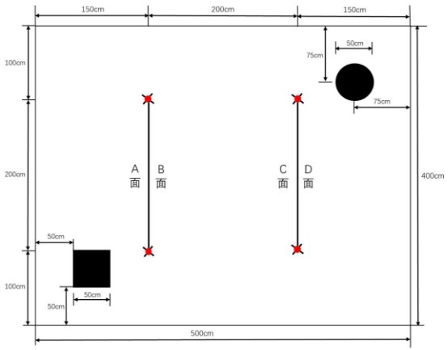
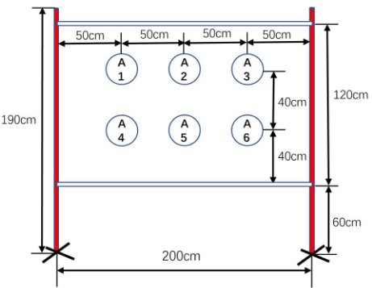

# 拓空者 + UWB 定位 + 双Openmv 方案
2024年全国大学生电子设计竞赛赛区赛     暨模拟电子系统设计专题赛初赛 

试题 

参赛注意事项

- 1）7 月 29 日 8:00 竞赛正式开始。本科组参赛队可在【本科组】或【本科组/高职高专组】 题目中任选一题；高职高专组参赛队原则上应在【本科组/高职高专组】题目中任选 一题，但也可以选择【本科组】题目。建议赛区对本科组参赛队和高职高专组参赛队 分开评审及评奖。高职高专组参赛队选择【本科组】题目的，与本科组参赛队一起进 行评审及评奖。只要参赛队中有本科生（含已专升本的学生），该队只能在本科组评 审及评奖。每支参赛队必须在竞赛第一天将竞赛组别上报赛区组委会，且不能更改。 凡不符合上述选题规定的作品均视为无效，赛区不予以评审。 
- 2）参赛队认真填写《登记表》内容，填写好的《登记表》交赛场巡视员暂时保存。
- 3）参赛者必须是有正式学籍的全日制在校本、专科学生，应出示能够证明参赛者学生身 份的有效证件（如学生证）随时备查。
- 4）每队严格限制 3 人，开赛后不得中途更换队员。
- 5）竞赛期间，可使用各种图书资料和网络资源，但不得在学校指定竞赛场地外进行设计 制作，不得以任何方式与他人交流，包括教师在内的非参赛队员必须迴避，对违纪参 赛队取消评审资格。
- 6）8 月 1 日 20:00 竞赛结束，上交设计报告、制作实物及《登记表》，由专人封存。

立体货架盘点无人机系统（**D** 题）** 

【本科组】

一、** 任务** 

设计并制作一款由多旋翼飞行器和带显示器的无线地面站构成的系统，能够 实现对立体货架上全部货物的自主巡检、盘点，以及对特定货物的单独盘点；地 面站能显示盘点结果信息。

图 1 为一个大小为 400cm×500cm 的仓库俯视图，黑色方形区域为起飞点、 黑色圆形区域为降落点，另有 2 个双面立体货架，每个货架两端为红色圆杆，立 体货架的 4 个面编号为 A 面、B 面、C 面、D 面，每个面上有 6 个固定坐标位置， 用于张贴包含货物编号信息的二维码（共 24 个二维码）。图 2 为货架 A 面的正 视图。 

图 1  立体货架仓库俯视图

图 2   A 面立体货架正视图

二、** 要求** 

- 1） 完成对立体货架的遍历盘点，地面站实时显示相关盘点结果信息。 1） 无人机在起飞点垂直起飞，至 150 ± 10cm  的高度；（5 分） 2） 无人机自主完成对 2 个货架 4 个面上全部货物的遍历盘点： 
- 1  盘点过程中，无人机使用机身上的激光笔指示盘点对象；盘点过程中

激光笔关闭，成功收集一个货物信息，激光笔在被盘点的二维码范围内点亮一次 （亮 0.5 秒左右）；（24 分） 

- 2  盘点过程中，地面站端用不小于 3.5 吋的 LCD 显示屏实时显示盘点结

果，即货物编号和位置坐标信息（货物编号为 1～24的数值；坐标信息为 A1~A6、 B1~B6、C1~C6、D1~D6）；无人机每盘点到一个货物，地面站上的 LED 灯亮灭 一次（亮 1 秒左右）；（12 分） 

3） 完成遍历盘点后，无人机稳定降落在降落点，无人机几何中心点不超出

降落区域；（5 分） 

4） 盘点结束后，地面站可显示全部盘点结果，并可输入货物编号查询，显

示货物坐标信息；（5 分） 

5） 遍历盘点过程用时越少越好。（10 分） 

- 2） 完成指定货物的定向盘点。

1） 无人机上电后，给无人机识别 1 张抽取的二维码，无人机报送识别的货

物编号给地面站显示；（2 分） 

2） 地面站 LCD 显示屏上显示规划的定点盘点航线图；（8 分） 

3） 启动无人机在起飞点垂直起飞，按照 2-（2）所规划航线飞往目标货物，

激光笔在被盘点的二维码范围内点亮一次（亮 0.5 秒左右），识别目标货 物二维码信息并传回地面站，地面站显示货物编号和坐标信息，地面站 上的 LED 灯亮灭一次（亮 1 秒左右）；（9 分） 

4） 完成定点盘点后，无人机稳定降落在降落点，无人机几何中心点不超出

降落区域；（5 分） 

5） 定点盘点过程用时越少越好。（10 分） 

- 3） 其他。（5 分） 
- 4） 设计报告。（20 分） 

三、**  说明** 

- 1）立体货架说明

1） 参赛队在赛区提供的场地测试，不得擅自改变测试环境条件。

2） 货架板面采用厚度为 5mm 的硬质白色 PVC 板制作，在板的双面固定位

置上随机张贴本题提供的 24 张二维码图像（内容为 1-24 的数字值），二 维码打印在白色 A4 纸张上，尺寸为 19cm×19cm 左右。  

3） 货架两端支架采用直径为  3~4cm 的红色（R-255、  G-0、  B-0）圆形杆，

高度不低于 190cm；应考虑到材料及颜料导致存在色差的可能性；2 个 圆形杆之间横向固定 2 个硬质白色杆子，货架板上可制作多个孔用于使 用扎带等固定在四周杆体上。

4） 400cm×500cm 作业区四周及顶部设置安全网，安全网支架安装在安全网

外。安全网外测试现场避免阳光直射，但不排除顶部照明灯及窗外环境 光照射，参赛队应考虑到测试现场会受到外界光照或室内照明不均等影 响因素，测试时不得提出光照条件要求。

- 2）无人机系统要求

1） 参赛队使用无人机时应遵守中国民用航空局的相关管理规定。

2） 无人机最大轴间距不大于 45cm。 

3） 无人机桨叶必须全防护，否则不予测试。 

4） 无人机上的激光笔水平向安装，不得移动、转动；激光笔照射到板面上

的光斑直径不得大于 6mm。 

5） 无人机辅助定位方式不限。

6） 调试及测试时必须佩戴防护眼镜，穿戴防护手套。

7） 测评起飞前，无人机可手动放置到起飞点，手动一键启动后起飞；起飞

后整个盘点过程中不得人为干预，盘点过程无人机不得降落；若采用无 人机以外的启动或急停操作装置，一键启动起飞操作后必须立刻将装置 交工作人员监管。 

8） 要求 2 起飞前，将抽取与货架上某一张二维码相同的图片给无人机识别，

识别前仅可按键或者点击系统屏幕一次；识别完成后，手动一键启动后 起飞。 

- 3）测试要求与说明

1） 无人机起飞至降落连续完成，期间不得人为干预。

2） 要求 1 的盘点过程必须在 270 秒内完成，超时相关评分模块不得分。

3） 要求 2 的盘点过程必须在 180 秒内完成，超时相关评分模块不得分。

4） 每次测试全过程中不得更换电池；两次测试之间允许更换电池，更换电

池时间不大于 2 分钟。 

5） 飞行期间，无人机触及地面后自行恢复飞行的，扣 5 分；触地后 5 秒内

不能自行恢复飞行视为失败，失败前完成动作仍计分。

6） 平稳降落是指在降落过程中无明显的跌落、弹跳及着地后滑行等情况出

现。 

四、**  评分标准** 

<table><tr><th colspan="1"></th><th colspan="1">项</b>  目</b> </th><th colspan="1"></th><th colspan="1">主要内容 </th><th colspan="1">满分</b> </th></tr>
<tr><td colspan="1"></td><td colspan="1">方案论证 </td><td colspan="1"></td><td colspan="1">技术路线、系统结构，方案描述、 比较与选择</td><td colspan="1" valign="top"><b>3</b> </td></tr>
<tr><td colspan="1"></td><td colspan="1">理论分析与计算</td><td colspan="1"></td><td colspan="1">控制方法描述及参数计算</td><td colspan="1" valign="bottom"><b>5</b> </td></tr>
<tr><td colspan="1" rowspan="2" valign="top">设计报告</b> </td><td colspan="1">电路与程序设计</td><td colspan="1"></td><td colspan="1">系统组成，原理框图与各部分电 路图，系统软件设计与流程图</td><td colspan="1" valign="top"><b>7</b> </td></tr>
<tr><td colspan="1">测试方案与测试结果</td><td colspan="1"></td><td colspan="1">测试方案及测试条件，测试结果 完整性，测试结果分析</td><td colspan="1" valign="top"><b>3</b> </td></tr>
<tr><td colspan="1"></td><td colspan="1">设计报告结构及规范性</td><td colspan="1"></td><td colspan="1">摘要、报告正文结构、公式、图 表的完整性和规范性</td><td colspan="1" valign="top"><b>2</b> </td></tr>
<tr><td colspan="1"></td><td colspan="1">合计</b> </td><td colspan="2"></td><td colspan="1" valign="bottom"><b>20</b> </td></tr>
<tr><td colspan="1"></td><td colspan="1">完成第 1 项 </td><td colspan="2"></td><td colspan="1" valign="bottom"><b>61</b> </td></tr>
<tr><td colspan="1" rowspan="2" valign="top">要求 </td><td colspan="1">完成第 2 项 </td><td colspan="2"></td><td colspan="1" valign="bottom"><b>34</b> </td></tr>
<tr><td colspan="1">完成第 3 项 </td><td colspan="2"></td><td colspan="1" valign="bottom"><b>5</b> </td></tr>
<tr><td colspan="1"></td><td colspan="1">合计</b> </td><td colspan="2"></td><td colspan="1" valign="bottom"><b>100</b> </td></tr>
<tr><td colspan="2"></td><td colspan="2">总</b>  分</b> </td><td colspan="1" valign="bottom"><b>120</b> </td></tr>
</table>

D -  7  /  7 
